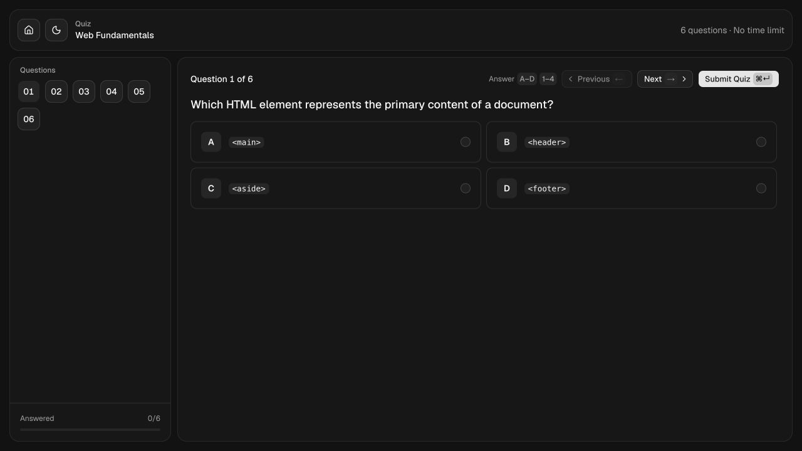

# MarkQ — Markdown to Quiz

[](https://github.com/huanngdev/markq/actions/workflows/ci.yml)
[](LICENSE)
[](https://bun.sh)

**Turn Markdown files into a clean, self-hosted quiz website.** Write questions, answers, and explanations in Markdown or Obsidian, drop the files into one folder, and MarkQ turns them into interactive quizzes with answer review and SQLite result history.

MarkQ is an open-source **Markdown quiz generator** built with Next.js, shadcn/ui, Bun, and SQLite. It is designed for teachers, study groups, certification practice, interview preparation, internal training, and anyone who wants a simple file-based alternative to a quiz CMS.



## Why MarkQ?

- **Markdown in, quiz out** — edit files directly or use the optional protected Markdown editor.
- **Obsidian-friendly** — quiz files remain readable and editable as ordinary `.md` notes.
- **Answers stay server-side** — correct answers and explanations are not included in the browser's quiz payload.
- **Built-in review** — show the selected answer, correct answer, and full Markdown explanation after submission.
- **Persistent progress** — SQLite stores autosaved in-progress work, scores, flags, shuffled order, and immutable review snapshots.
- **Self-hosted and private** — your content and results stay on infrastructure you control.
- **Responsive and accessible** — keyboard shortcuts, light/dark mode, and layouts for desktop and mobile.

## Features

- Single-answer and multiple-answer quizzes loaded from `content/quizzes/*.md`.
- Versioned settings for time limits, shuffling, navigation, unanswered questions, review policy, scoring, passing score, penalties, and attempt limits.
- Markdown questions and explanations with GFM, code blocks, lists, and local images.
- One-question-at-a-time workspace with fast question navigation.
- Server-authoritative deadlines, grading, expiration, ownership, and Zod validation.
- Correct, incorrect, and unanswered result breakdowns.
- Analytics by subject and topic, including weak-topic ranking, missed-question examples, and linked review lessons.
- Attempt history with quiz snapshots, so old reviews remain accurate after a quiz changes.
- Dark mode based on system preference with a manual toggle.
- Autosave/resume, per-question points, flags, exact or partial scoring, and an optional protected `/manage` editor.
- CLI validation plus a bundled Codex skill for authoring valid quizzes.
- SEO metadata, Open Graph/Twitter images, `robots.txt`, and a generated sitemap.

## Tech stack

- [Next.js](https://nextjs.org/) App Router, React, and TypeScript
- [shadcn/ui](https://ui.shadcn.com/), Base UI, and Tailwind CSS
- [Bun](https://bun.sh/) as the only package manager and runtime
- [SQLite](https://sqlite.org/) with [Drizzle ORM](https://orm.drizzle.team/)
- `gray-matter`, Unified, Remark, and React Markdown
- Zod for content and API validation

## Quick start

Requirements: **Bun 1.3.14 or newer**.

```bash
git clone https://github.com/huanngdev/markq.git
cd markq
bun install
cp .env.example .env.local
bun run db:migrate
bun run dev
```

Open [http://localhost:3000](http://localhost:3000). MarkQ also applies missing migrations automatically when the database is first opened.

## Create a quiz from Markdown

Create a file such as `content/quizzes/javascript-basics.md`:

```md
---
schemaVersion: 2
id: javascript-basics
title: JavaScript Basics
description: Test your JavaScript fundamentals.
tags:
  - javascript
  - beginner
published: true
visibility: public
settings:
  timeLimitMinutes: 20
  shuffleQuestions: true
  shuffleOptions: true
  navigationMode: free
  allowUnanswered: true
  reviewMode: after-submit
  passingScore: 70
  expireBehavior: auto-submit
  scoringMode: exact
  incorrectPenalty: 0
  attemptsAllowed: null
---

# JavaScript Basics

## typeof-null

### Topic

javascript-types

### Question

What does `typeof null` return in JavaScript?

### Options

- [ ] A. `null`
- [ ] B. `object`
- [ ] C. `undefined`
- [ ] D. `number`

### Answer

B

### Explanation

This is a historical JavaScript behavior. Although `null` is a primitive value, `typeof null` returns `"object"`.
```

Validate every quiz before running or deploying:

```bash
bun run quiz:validate
```

The repository includes a working [example quiz](content/quizzes/example-quiz.md) and the complete [quiz format reference](.agents/skills/markq-quiz-author/references/format.md).

### Format rules

- Quiz and question IDs must be stable, unique, and kebab-case.
- New quizzes use `schemaVersion: 2`; legacy files without it remain supported.
- Every question must contain `Question`, `Options`, `Answer`, and `Explanation`; optional `Points` defaults to 1.
- Add an optional kebab-case `Topic` to group results in Analytics and connect the question to a knowledge article.
- Each option uses one line: `- [ ] A. Option content`.
- A single answer is a bare option ID. Multiple answers use one list item per correct ID.
- Questions, explanations, and option content support Markdown.
- `public` quizzes appear in the catalog, `unlisted` quizzes require a direct link, and `private` quizzes are not publicly available.

### Keeping private quizzes out of Git

MarkQ ignores every `content/quizzes/*.md` file except the public `example-quiz.md`. Your local quizzes therefore stay private by default.

To publish a quiz with your fork, add an allow rule to `.gitignore`:

```gitignore
!/content/quizzes/your-public-quiz.md
```

Private source material and quiz-generation instructions belong in
`local/quiz-authoring/<project>/`. The entire `local/` directory is ignored and
is never required by the app. Generated quiz files still go in
`content/quizzes/`, where they remain private unless explicitly allowlisted.

## Analytics and knowledge articles

The **Analytics** tab summarizes completed attempts for the current guest session. It separates English and IQ results, ranks topics by incorrect answers and accuracy, and shows the questions most often missed. Unanswered questions are tracked separately from incorrect answers.

To add review material, create a Markdown file in `content/knowledge/`:

```md
---
subject: english
title: English knowledge base
description: Grammar and vocabulary lessons.
---

## english-second-conditional | Second conditional

Use the second conditional for unreal or unlikely present and future situations.

**Form:** `If + past simple, would + base verb`.

### Example

If I had more time, I would study another language.
```

The text before `|` must exactly match a question's `Topic`; the text after it is the display title. Article bodies support Markdown and can include formulas, reasoning, hints, examples, and common mistakes. Run `bun run quiz:validate` to catch missing or duplicate topic references.

Like private quizzes, `content/knowledge/*.md` is ignored by Git by default. Add an explicit allow rule only when you intend to publish a knowledge file.

## Keyboard shortcuts

| Shortcut | Action |
| --- | --- |
| Option ID or `1`–`9` | Select or toggle an answer |
| `←` / `→` | Previous / next question |
| `F` | Flag the current question |
| `Ctrl` + `Enter` or `⌘` + `Enter` | Submit the quiz |
| `Alt` + `T` or `⌥` + `T` | Toggle light/dark mode |

Shortcuts are disabled while focus is inside a text input or dialog.

## Configuration

Copy `.env.example` to `.env.local`:

```dotenv
DATABASE_URL=./data/markq.db
NEXT_PUBLIC_SITE_URL=https://quiz.example.com
MARKQ_ADMIN_TOKEN=replace-with-at-least-32-random-characters
```

| Variable | Required | Description |
| --- | --- | --- |
| `DATABASE_URL` | No | SQLite path. Defaults to `./data/markq.db`. |
| `NEXT_PUBLIC_SITE_URL` | Production SEO | Public origin used for canonical URLs, Open Graph metadata, and the sitemap. |
| `MARKQ_ADMIN_TOKEN` | No | Enables `/manage` and its API when set to at least 32 characters. Keep it secret. |

When deployed on Vercel, MarkQ also reads `VERCEL_PROJECT_PRODUCTION_URL` automatically if `NEXT_PUBLIC_SITE_URL` is not set.

## SQLite and deployment

MarkQ writes attempts to the SQLite file configured by `DATABASE_URL`. For production, deploy to a server or container with a **persistent volume** mounted for the `data` directory. An ephemeral or read-only filesystem will lose result history or prevent submissions.

Use `GET /api/health` for readiness checks. It verifies SQLite and reports invalid quiz documents. A degraded quiz catalog returns HTTP 503 so deployment monitoring can detect content errors.

Example backup:

```bash
sqlite3 data/markq.db ".backup 'markq-backup.db'"
```

The app can be deployed anywhere that supports Bun/Node-compatible Next.js servers and persistent storage. Build and start it with:

```bash
bun run build
bun run start
```

## Available scripts

| Command | Purpose |
| --- | --- |
| `bun run dev` | Start the development server |
| `bun run build` | Create a production build |
| `bun run start` | Run the production server |
| `bun run lint` | Run ESLint |
| `bun run typecheck` | Run strict TypeScript checks |
| `bun test` | Run unit tests |
| `bun run db:generate` | Generate a Drizzle migration |
| `bun run db:migrate` | Apply SQLite migrations |
| `bun run quiz:validate` | Validate all Markdown quizzes |

## Architecture and security

```text
content/quizzes/*.md
        │
        ▼
Markdown parser + validator ──► start/resume use case ──► safe attempt DTO ──► browser hook
        │                              │                         │
        │                              └──► SQLite autosave ◄────┘
        └──► server timer + grading ──► immutable review snapshot ──► review UI
```

Correct answers and explanations never cross into the active quiz workspace. The server snapshots settings, shuffled question/option order, answer keys, and explanations when the attempt starts; only safe fields reach the browser. It validates and autosaves every selection, enforces the deadline and owner, grades idempotently, then exposes the review snapshot only when review is enabled.

Each browser receives an opaque, HTTP-only guest session and can access only its own attempts. This is an ownership boundary rather than account authentication: deployments that need named users, cross-device history, SSO, or high-stakes identity verification should replace the session adapter with their authentication provider while keeping the application/repository ports.

## Manage quiz content

Directly adding `.md` files remains the simplest workflow. To enable the optional browser editor, configure `MARKQ_ADMIN_TOKEN`, restart MarkQ, and open `/manage`. Enter the token to list, create, validate, and atomically save quiz files. The token is sent as a Bearer credential and is never stored in a cookie; do not expose it in client environment variables.

## AI-assisted quiz authoring

The project includes a `markq-quiz-author` skill for Codex-compatible agents. Example prompt:

```text
Use $markq-quiz-author to create a 20-question quiz about HTTP fundamentals.
```

Structured JSON can also be converted deterministically:

```bash
python3 .agents/skills/markq-quiz-author/scripts/generate_quiz.py --input quiz.json
bun run quiz:validate
```

The generator refuses malformed IDs, duplicate questions, missing explanations, unknown answers, multiline options, and accidental overwrites.

## Contributing

Contributions are welcome. Read [CONTRIBUTING.md](CONTRIBUTING.md), then run the complete local check before opening a pull request:

```bash
bun run quiz:validate
bun run lint
bun run typecheck
bun test
bun run build
```

MarkQ is released under the [MIT License](LICENSE).
